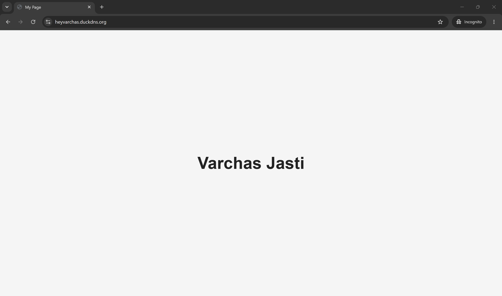
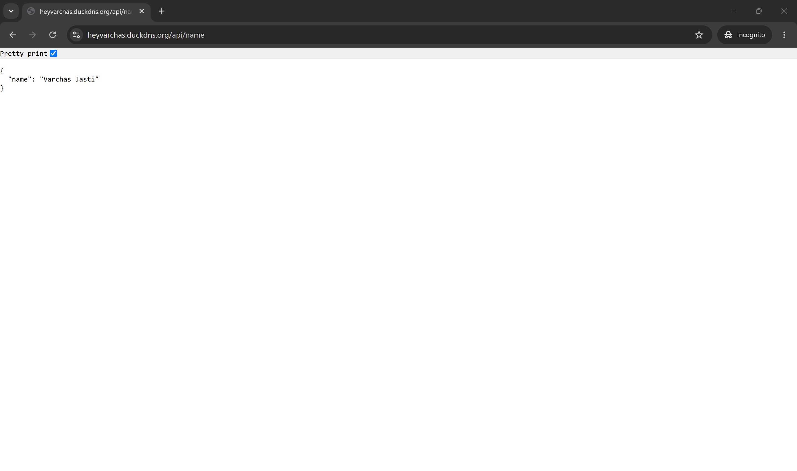

# Dockerized Full-Stack Deployment with Nginx Reverse Proxy


A minimal full-stack deployment demonstrating how to deploy a static frontend and an Express.js backend using Docker Compose and an Nginx reverse proxy. The project serves the frontend over HTTPS, routes API requests to the backend, and uses Let's Encrypt certificates generated through Certbot for secure communication.

---

## Table of Contents

- [Project Overview](#project-overview)
- [Key Features](#key-features)
- [Tech Stack](#tech-stack)
- [Folder Structure](#folder-structure)
- [Architecture Overview](#architecture-overview)
- [Installation](#installation)
- [Configuration](#configuration)
- [Usage](#usage)
- [API Endpoints](#api-endpoints)
- [Scripts](#scripts)
- [Important Dependencies](#important-dependencies)
- [Design Decisions / Project Structure](#design-decisions--project-structure)
- [Screenshots / Demo](#screenshots--demo)
- [Known Limitations](#known-limitations)
- [Future Improvements](#future-improvements)
- [Contributing](#contributing)
- [License](#license)
- [Acknowledgements](#acknowledgements)

---

# Project Overview

This project demonstrates how to deploy a containerized full-stack application using Docker Compose. The frontend is served through Nginx, while the backend is implemented using Express.js. Nginx also acts as a reverse proxy, forwarding API requests to the backend and terminating HTTPS using SSL certificates issued by Let's Encrypt.

---

# Key Features

- Static frontend served from its own Docker container.
- Express.js backend exposing a REST API.
- Nginx reverse proxy for routing requests.
- HTTP to HTTPS redirection.
- SSL/TLS using Let's Encrypt certificates.
- Multi-container deployment with Docker Compose.
- Beginner-friendly deployment workflow suitable for cloud VMs.

---

# Tech Stack

### Backend

- Node.js
- Express.js

### Frontend

- HTML

### Infrastructure

- Docker
- Docker Compose
- Nginx
- Certbot
- Let's Encrypt

---

# Folder Structure

```text
task-03-deployment/
├── backend/
│   ├── Dockerfile
│   ├── index.js
│   └── package.json
│
├── frontend/
│   ├── Dockerfile
│   └── index.html
│
├── nginx/
│   └── nginx.conf
│
├── demo/
│   ├── backend.png
│   └── frontend.png
│
└── docker-compose.yml
```

### What the major folders do

- `backend/` — Express.js server exposing the REST API.
- `frontend/` — Static webpage served through an Nginx container.
- `nginx/` — Reverse proxy configuration, HTTPS setup, and request routing.
- `demo/` — Screenshots of the deployed application.
- `docker-compose.yml` — Defines and orchestrates all project containers.

---

# Architecture Overview

Incoming requests first reach the Nginx reverse proxy. HTTP traffic is redirected to HTTPS, SSL is terminated using Let's Encrypt certificates, and requests are routed internally based on their path.

- Requests to `/` are forwarded to the frontend container.
- Requests beginning with `/api/` are forwarded to the backend container.
- Docker Compose provides an internal network that allows services to communicate using their service names.

```text
                    HTTPS
                      │
                      ▼
             +------------------+
             |      Nginx       |
             |  Reverse Proxy   |
             +------------------+
                │           │
                │           │
                ▼           ▼
         Frontend       Backend
       (Static HTML)   (Express API)
```

---

# Installation

## Prerequisites

- Ubuntu Server (recommended)
- Docker
- Docker Compose
- A registered domain or DuckDNS hostname
- Ports **80** and **443** open on your VM

## Local setup

Clone the repository.

```bash
git clone https://github.com/heyvarchas/tsg-web-sec-tasks.git
cd task-03-deployment
```

Build and start all services.

```bash
docker compose up --build
```

---

## Deployment Workflow

### 1. Provision a Linux VM

SSH into your server.

```bash
ssh -i <private-key>.pem ubuntu@<VM_IP>
```

### 2. Install Docker

```bash
sudo apt update

sudo apt install -y docker.io docker-compose

sudo usermod -aG docker $USER

newgrp docker
```

Verify the installation.

```bash
docker --version
```

---

### 3. Clone the Repository

```bash
git clone https://github.com/heyvarchas/tsg-web-sec-tasks.git

cd task-03-deployment
```

---

### 4. Configure Your Domain

Point your domain (or DuckDNS hostname) to the public IP address of your VM.

Then update the following values inside:

```
nginx/nginx.conf
```

Replace:

- `server_name`
- SSL certificate path
- SSL private key path

with values corresponding to your own domain.

---

### 5. Generate SSL Certificates

Install Certbot.

```bash
sudo apt install -y certbot
```

Generate a certificate.

```bash
sudo certbot certonly --standalone -d your-domain.com
```

The generated certificates are mounted into the Nginx container using Docker Compose.

---

### 6. Start the Application

```bash
docker compose up --build
```

Docker Compose starts:

- Backend container
- Frontend container
- Nginx reverse proxy

---

### 7. Verify Deployment

Open:

```
https://your-domain.com
```

Then verify the API endpoint:

```
https://your-domain.com/api/name
```

Expected response:

```json
{
    "name": "Varchas Jasti"
}
```

---

### Updating an Existing Deployment

Pull the latest changes.

```bash
git pull
```

Rebuild the containers.

```bash
docker compose down

docker compose up --build
```

---

# Configuration

## Nginx

The reverse proxy configuration is located in:

```
nginx/nginx.conf
```

Before deployment, update:

- `server_name`
- SSL certificate path
- SSL private key path

to match your own domain.

---

## Environment Variables

This project does **not** require any environment variables.

---

# Usage

After deployment:

Frontend:

```
https://your-domain.com
```

Backend API:

```
https://your-domain.com/api/name
```

---

# API Endpoints

Base URL

```
https://your-domain.com
```

| Method | Endpoint | Purpose |
|---------|----------|----------|
| GET | `/api/name` | Returns a JSON object containing the configured name. |

Example response

```json
{
    "name": "Varchas Jasti"
}
```

---

# Scripts

### Backend (`backend/package.json`)

| Script | Command | Description |
|---------|---------|-------------|
| `start` | `node index.js` | Starts the Express server. |

### Docker

| Command | Description |
|---------|-------------|
| `docker compose up --build` | Builds and starts all containers. |
| `docker compose down` | Stops and removes all running containers. |

---

# Important Dependencies

### Backend

- `express` — HTTP server and routing.

### Infrastructure

- Docker
- Docker Compose
- Nginx
- Certbot
- Let's Encrypt

---

# Design Decisions / Project Structure

- The frontend, backend, and reverse proxy are separated into independent containers.
- Docker Compose manages service orchestration and networking.
- Nginx acts as the single entry point for all incoming requests.
- SSL termination is handled by Nginx using certificates generated through Certbot.
- The backend only exposes API endpoints, while the frontend is served independently through Nginx, resulting in a clean separation of responsibilities.

---

# Screenshots / Demo

### Frontend



---

### Backend API



---

# Known Limitations

- The backend currently exposes only a single API endpoint.
- SSL certificate renewal is not automated.
- No persistent database is included.
- No authentication or authorization is implemented.
- No CI/CD pipeline or automated testing is configured.

---

# Future Improvements

- Automate SSL renewal.
- Add a CI/CD deployment pipeline.
- Introduce health checks for all containers.
- Add monitoring and centralized logging.
- Integrate a persistent database.
- Add environment variable support for deployment configuration.

---

# Contributing

1. Fork the repository.
2. Create a feature branch.

```bash
git checkout -b feature/my-change
```

3. Test your changes locally.

```bash
docker compose up --build
```

4. Commit and push your changes.

5. Open a Pull Request with a clear description of your modifications.

---

# License

MIT License.

---

# Acknowledgements

Built using Node.js, Express.js, Docker, Docker Compose, Nginx, Certbot, and Let's Encrypt.